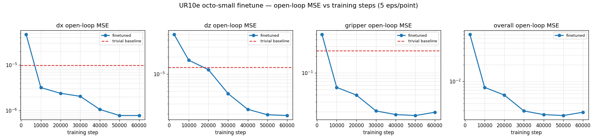
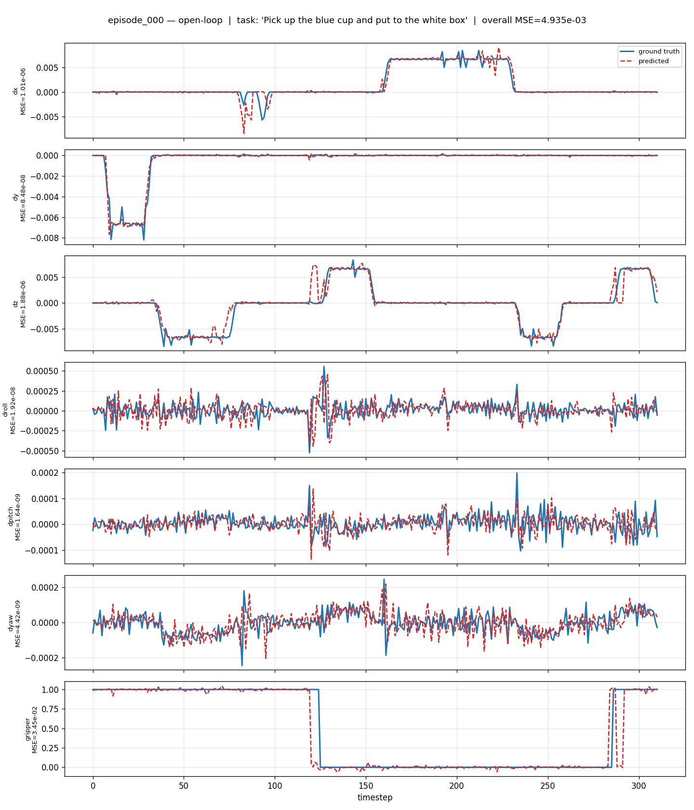

# Finetuning Octo on a New Embodiment (UR10e)

This guide walks through finetuning `octo-small-1.5` on a real robot — a UR10e (6 DoF)
with a binary Robotiq gripper — from raw teleop recordings to an evaluated checkpoint.

The four steps are:

1. **Prepare the data** — convert raw HDF5 episodes into RLDS (the format Octo reads)
2. **Configure the finetune** — point Octo at your dataset and action space
3. **Run the finetune** — detached, with wandb logging
4. **Evaluate** — open-loop, predicted vs. ground-truth action trajectories

> **Important:** Step 1 ends with a data sanity check. Do not skip it. A silently
> degenerate dataset trains to a beautiful-looking loss curve and a useless policy.
> See [Interpreting the Result](#interpreting-the-result).

---

## Setup

Octo needs both PyTorch (the model) and TensorFlow (the RLDS data pipeline), plus JAX
to read the pretrained checkpoint weights.

```bash
uv venv --python 3.10.12 .venv        # NOT 3.10.0 — see Troubleshooting
source .venv/bin/activate

uv pip install -e .
uv pip install -r requirements.txt
uv pip install torch torchvision accelerate h5py opencv-python
uv pip install -r requirements_compat_pins.txt   # version pins that keep the stack working
```

Verify:

```bash
python -c "import torch, tensorflow, jax; from transformers import FlaxAutoModel; \
print('cuda:', torch.cuda.is_available())"
```

---

## Step 1: Prepare the data

Octo reads **RLDS** (a TFDS dataset of episodes). It cannot read LeRobot parquet or
GR00T layouts. One conversion serves both `octo` (JAX) and `octo-pytorch` — the data
pipeline is identical.

### Convert

`convert_ur_to_rlds.py` reads `episodes/*.hdf5` and writes an RLDS dataset:

```bash
python convert_ur_to_rlds.py --src episodes --out rlds --stride 5
```

This produces `rlds/ur10e_pick_cup/1.0.0/` with tfrecord shards.

### Key parameters

| Parameter | Description |
|---|---|
| `--stride` | Keep every Nth frame. Recordings run at ~20–30 Hz; bridge-style pretraining data is ~5 Hz. Stride 5 gives ~6 Hz, so per-step deltas have a magnitude the pretrained model recognizes. |
| `--primary-size` | Side-camera size (default 256 — what `image_primary` expects). |
| `--wrist-size` | Wrist-camera size (default 128 — what `image_wrist` expects). |
| `--img-mode` | `resize` squashes 640×480 to square (matches OXE preprocessing); `crop` center-crops instead. |
| `--tcp-z-offset` | Tool z-offset added to the flange FK, in meters. |

### What it emits per step

The action follows the bridge/OXE `EEF_POS` convention, which is what the pretrained
diffusion head was trained on — so the head is **reused**, not reinitialized:

```
observation/image        (256,256,3) uint8   side cam    -> image_primary
observation/wrist_image  (128,128,3) uint8   wrist cam   -> image_wrist
observation/state        (7,) float32        [x,y,z, roll,pitch,yaw, gripper]
action                   (7,) float32        [dx,dy,dz, droll,dpitch,dyaw, gripper]
language_instruction     str                 from metadata/task_description
```

EEF pose comes from UR10e forward kinematics on the recorded joints; `action[0:6]` is
the world-frame delta between consecutive kept frames, and `action[6]` is the absolute
binary gripper (1=open, 0=closed), which is left un-normalized.

### ✅ Sanity-check the data before you train

**Your actions must actually vary.** If the arm didn't move — or the joint stream
wasn't recorded — the deltas are all zero and the model will happily learn to output
nothing.

```bash
python -c "
import h5py, numpy as np
j = h5py.File('episodes/episode_000000.hdf5')['observations/arm_joint_pos'][:]
print('joint std per dim:', j.std(0))
print('unique joint rows:', len(np.unique(j, axis=0)), 'of', len(j))"
```

| Signal | Healthy | Broken |
|---|---|---|
| joint std | ~1e-1 – 1e0 rad | ~1e-5 (sensor noise only) |
| unique rows | hundreds | **1** |

If you see `unique joint rows: 1`, the arm joints were never logged (the recorder held
a default pose). Fix the recording before spending GPU time. The cameras moving is
*not* sufficient — the joints are what become actions.

---

## Step 2: Configure the finetune

Copy [`scripts/configs/finetune_ur10e.py`](scripts/configs/finetune_ur10e.py) and edit
the dataset block for your robot:

```python
FINETUNING_KWARGS = {
    "name": "ur10e_pick_cup",
    "data_dir": "/abs/path/to/rlds",
    "image_obs_keys": {"primary": "image", "wrist": "wrist_image"},
    "proprio_obs_key": None,          # octo-small-1.5 has no proprio tokenizer
    "language_key": "language_instruction",
    "action_proprio_normalization_type": "normal",
    "action_normalization_mask": [True]*6 + [False],   # don't normalize the gripper
    "standardize_fn": None,           # data is already in octo layout
}
```

> **Note:** `standardize_fn=None` is deliberate. The OXE `bridge_dataset_transform`
> re-derives actions as state deltas — but our converter *already* emits deltas.
> Applying it would difference the data twice and silently corrupt your actions.

### Key parameters

| Parameter | Description |
|---|---|
| `batch_size` | 16 fits a 12 GB card (peaks ~8.4 GB). Lower it if you OOM. |
| `window_size` | 2 — matches `octo-small-1.5`'s observation history. |
| `action_horizon` | 4 — actions predicted per query. |
| `num_steps` | 10000 is ample for ~10 demos of one task (~1.7 h on an RTX 3060). |
| `finetuning_mode` | `full` (all weights), `head_only`, or `head_mlp_only`. |
| `modality` | `language_conditioned`, `image_conditioned`, or `multimodal`. |
| `action_normalization_mask` | `[True]*6 + [False]` keeps the binary gripper at 0/1. |

Normalization statistics are computed automatically on first load and cached next to
the dataset.

---

## Step 3: Run the finetune

```bash
export WANDB_API_KEY=<your-key>
screen -dmS octo_ft scripts/run_finetune_ur10e.sh
```

Or invoke it directly:

```bash
torchrun --nproc_per_node 1 scripts/finetune_pt.py \
  --name ur10e_pick_cup \
  --config scripts/configs/finetune_ur10e.py:full,language_conditioned \
  --config.pretrained_path=hf://rail-berkeley/octo-small-1.5 \
  --config.batch_size=16 \
  --config.num_steps=10000 \
  --config.save_interval=2500 \
  --config.save_dir=./checkpoints
```

Monitor:

```bash
screen -r octo_ft          # attach (Ctrl-A D to detach)
tail -f finetune_ur10e.log
```

The T5 language encoder stays frozen; on `octo-small-1.5` you train ~27 M params and
freeze ~110 M. Checkpoints land in
`checkpoints/octo_finetune/<run_name>/<step>/`, alongside `dataset_statistics.json` —
you need that file at inference to un-normalize actions.

> **Note:** `finetune_pt.py` imports `ValidationCallback` but never calls it, so
> **train loss is the only metric you get**. It says nothing about generalization.
> That's what Step 4 is for.

---

## Step 4: Evaluate (open-loop)

Open-loop = the policy never drives the robot. We replay a recorded episode, and every
`action_horizon` steps we show the policy the *recorded* observation and ask it to
predict the next chunk of actions. The predictions are stitched together and compared
against ground truth. No simulator or hardware needed.

```bash
python open_loop_eval.py \
  --checkpoint checkpoints/octo_finetune/<run_name> \
  --data-dir rlds --dataset-name ur10e_pick_cup \
  --episodes 3 --out eval_out
```

| Parameter | Description |
|---|---|
| `--checkpoint` | Run directory (the one holding `config.json` and step subdirs). |
| `--step` | Which checkpoint step to load (default: latest). |
| `--episodes` | How many episodes to evaluate. |
| `--action-horizon` | Actions per policy query (default 4, matches training). |

It prints per-dimension MSE/MAE and writes one figure per episode: a subplot per action
dimension, ground truth (solid) vs. prediction (dashed).

### Interpreting the result

Read the printout in this order:

1. **Check `gt std` first, not MSE.** If a dimension's ground-truth std is `0.0`, that
   dimension is constant in your data and its MSE is meaningless — a model that outputs
   a constant scores a perfect 0.0. This is the failure mode the Step 1 check catches.
2. **Compare `pred std` to `gt std`.** They should be the same order of magnitude. A
   prediction std far below ground truth means the policy is regressing to the mean
   (predicting "average" motion instead of committing).
3. **Then look at MSE**, and look at the plot. The dashed line should track the solid
   one's shape, not just its average level.

Reference output from a run on a **broken** dataset — the arm joints were never
recorded, so all six arm dims are constant zero:

```
  dx       MSE=0.000e+00   | gt std=0.000e+00  pred std=0.000e+00   <-- degenerate
  dy       MSE=0.000e+00   | gt std=0.000e+00  pred std=0.000e+00   <-- degenerate
  ...
  gripper  MSE=2.684e-03   | gt std=4.971e-01  pred std=4.915e-01   <-- actually learned
```

The gripper row is what a *healthy* dimension looks like: comparable stds, small MSE,
and a plot where the prediction tracks the open/close transitions. The `dx…dyaw` rows
are what a degenerate one looks like — a "perfect" 0.0 MSE that means nothing. **A low
overall MSE is not evidence of success if the ground truth never moved.**

### Actual result (UR10e pick-cup, 64 episodes)

A real run: 64 episodes (`stride 2`, prompt *"Pick up the blue cup and put to the white
box"*), full finetune, batch 16, **60 000 steps** (~9.8 h on an RTX 3060). Open-loop MSE
per checkpoint, 5 episodes each:

| step | dx | dz | gripper | overall |
|---|---|---|---|---|
| 2 499 | 4.7e-5 | 5.0e-5 | 0.499 | 7.1e-2 |
| 9 999 | 3.2e-6 | 1.8e-5 | 0.055 | 7.8e-3 |
| 19 999 | 2.4e-6 | 1.2e-5 | 0.040 | 5.7e-3 |
| 29 999 | 2.0e-6 | 4.5e-6 | 0.021 | 2.9e-3 |
| 39 999 | 1.1e-6 | 2.4e-6 | 0.018 | 2.5e-3 |
| 49 999 | 7.7e-7 | 1.9e-6 | 0.017 | 2.42e-3 |
| **59 999** | **7.7e-7** | **1.9e-6** | **0.019** | **2.78e-3** |
| *trivial baseline* | *9.8e-6* | *1.3e-5* | *0.25* | — |

*Baseline = always predict 0 (for `dx`/`dz`) or the dataset mean (`gripper`). A policy
that doesn't beat these has learned nothing.*



Reading it:

- **It worked.** The final policy beats the baselines by 8–15× on every meaningful
  dim (`dx` 14×, `dz` 8×, `gripper` 15×). Contrast step 2 499, which is *worse* than
  baseline — that's what under-training looks like.
- **Judge only `dx`/`dy`/`dz`/`gripper`.** The wrist is held fixed in this task
  (rotation std ~1e-4 rad), so `droll`/`dpitch`/`dyaw` score ~0 trivially and tell you
  nothing.
- **Converged by ~40k**, flat after; 49 999 vs 59 999 differ only within 5-episode
  noise (a 10-episode re-eval ties them). A future rerun could stop at ~45k. There is no
  meaningful overfitting at 60k.
- **The grasp/release timing is right** — in the per-episode plot below, the predicted
  gripper (dashed) flips closed at step ~119 vs. ground-truth 124, and reopens at ~283
  vs. 285. Correct task structure, not just a low average error.



---

## Troubleshooting

| Symptom | Cause / Fix |
|---|---|
| All arm MSE = 0, flat lines in plots | Actions are constant. Joints weren't recorded — re-record. Run the Step 1 check. |
| Loss falls smoothly to ~0 but the policy does nothing | Same as above: the model learned to output a constant. |
| `Segmentation fault` during conversion | TFDS probes `gs://tfds-data` on builder init and TF's GCS plugin crashes offline. Set `tfds.core.utils.gcs_utils._is_gcs_disabled = True` (already done in the converter). |
| `ValueError: loop argument must agree with lock` | Python **3.10.0** asyncio bug hit during orbax checkpoint restore. Rebuild the venv on 3.10.12+. |
| `cannot import name 'FlaxAutoModel'` | `transformers` 5.x dropped Flax. Pin `transformers==4.34.1`. |
| `cannot import name 'runtime_version' from 'google.protobuf'` | `tensorflow-metadata` wants protobuf ≥5.26, TF 2.15 wants <5. Pin `tensorflow-metadata==1.14.0`. |
| wandb: `API key must be 40 characters long` | New-style `wandb_v1_` keys are rejected by the pinned client. Pass the key via `WANDB_API_KEY` env instead of `wandb login`. |
| CUDA OOM | Lower `--config.batch_size` (16 → 8). Batch 16 peaks at ~8.4 GB. |
| Actions look doubly-differenced / wrong scale | A `standardize_fn` is re-deriving deltas from data that already contains deltas. Set `standardize_fn=None`. |

---

## Deploying

At inference you need the checkpoint **and** its `dataset_statistics.json`:

```python
from octo.model.octo_model_pt import OctoModelPt

model = OctoModelPt.load_pretrained("checkpoints/octo_finetune/<run_name>")["octo_model"]
model = model.to("cuda:0").eval()

task = model.create_tasks(texts=["pick up the cup"], device="cuda:0")
actions = model.sample_actions(
    observation,                      # image_primary (1,2,3,256,256) uint8, image_wrist (1,2,3,128,128),
                                      # timestep_pad_mask (1,2) bool
    task,
    unnormalization_statistics=model.dataset_statistics["action"],
)                                     # -> (1, action_horizon, 7), un-normalized
```

The returned actions are world-frame EEF deltas plus an absolute binary gripper — feed
them to your controller at roughly the rate implied by your `--stride`.
